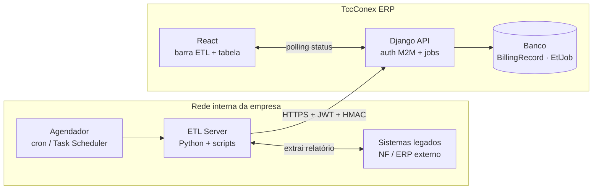
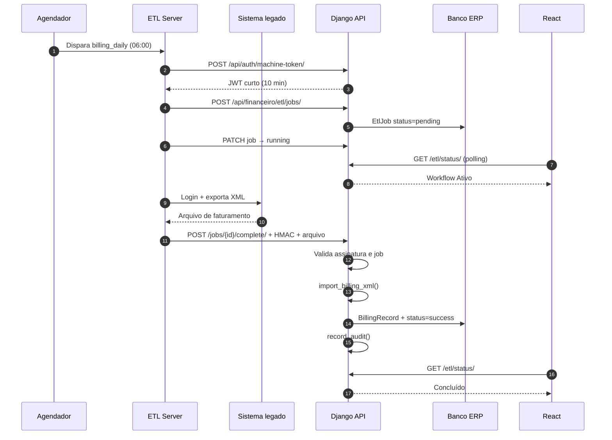
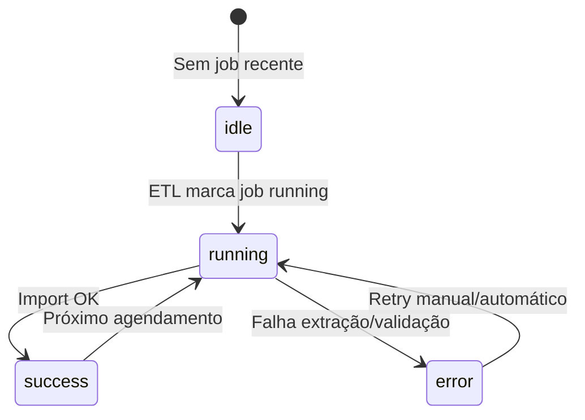

# ETL Server — Arquitetura e Implementação Segura

Documento de referência para integrar o **ETL Server** (servidor interno da empresa) com o **TccConex ERP**, permitindo execução automática de scripts que acessam sistemas legados, extraem relatórios e alimentam módulos como o **Faturamento Diário por Filial**.

> **Status:** especificação — a barra “ETL Server / Workflow Ativo” no frontend é placeholder; a integração descrita aqui ainda não está implementada por completo.

---

## 1. Objetivo

| Papel | Responsabilidade |
|---|---|
| **ETL Server** | Executar scripts (extração, transformação), guardar credenciais dos sistemas externos, reportar status |
| **Backend Django** | Autenticar o ETL, registrar jobs, importar dados, auditar, expor status à UI |
| **Frontend React** | Exibir na barra acima da tabela se o workflow está rodando, concluiu ou falhou |

**Primeiro caso de uso:** faturamento diário por filial — substituir (ou complementar) a importação manual de XML por execução automática agendada.

---

## 2. Princípios de segurança (obrigatórios)

1. **ETL Server nunca exposto à internet** — apenas rede interna ou VPN corporativa.
2. **ERP não guarda senhas de sistemas legados** — credenciais ficam só no ETL Server.
3. **Comunicação máquina-a-máquina (M2M)** — sem usar login de usuário humano nos scripts.
4. **Menor privilégio** — token/credencial do ETL só pode: criar job, reportar status, enviar arquivo de billing.
5. **Integridade** — assinatura HMAC + timestamp em cada callback (anti-replay).
6. **Idempotência** — o mesmo job não importa dados duas vezes.
7. **Auditoria** — toda execução registrada em `record_audit()` (app `audit`).
8. **TLS** — HTTPS obrigatório entre ETL e API (TLS 1.2+; preferir 1.3).

---

## 3. Visão geral da arquitetura

```
┌─────────────────────────────────────────────────────────────────┐
│                    REDE INTERNA DA EMPRESA                       │
│                                                                  │
│  ┌──────────────┐    scripts     ┌─────────────────────────┐   │
│  │ Sistemas     │◄───────────────│ ETL Server (Windows/Linux)│   │
│  │ legados      │                │  - Python 3.11+           │   │
│  │ (NF, ERP…)   │                │  - APScheduler / cron     │   │
│  └──────────────┘                │  - secrets locais (.env)  │   │
│                                   └────────────┬────────────┘   │
│                                                │ HTTPS + JWT M2M │
└────────────────────────────────────────────────┼────────────────┘
                                                 ▼
┌─────────────────────────────────────────────────────────────────┐
│                         TccConex ERP                             │
│  ┌─────────────┐   ┌──────────────┐   ┌─────────────────────┐  │
│  │ React       │──►│ Django API   │──►│ PostgreSQL / SQLite │  │
│  │ (polling)   │   │ + Celery     │   │ BillingRecord, EtlJob│  │
│  └─────────────┘   │ + Redis      │   └─────────────────────┘  │
│                    └──────────────┘                              │
└─────────────────────────────────────────────────────────────────┘
```

**Regra de ouro:** o ETL **empurra** resultados para a API. O Django **não** abre SSH/RDP no ETL Server.

---

## 4. Fluxo do Faturamento Diário (billing_daily)

### 4.1 Sequência

```
1. [Agendador ETL] dispara workflow billing_daily (ex.: 06:00)
2. [ETL] POST /api/financeiro/etl/jobs/  → cria job, status=pending
3. [ETL] PATCH  /api/financeiro/etl/jobs/{id}/  → status=running
4. [ETL] executa script: login sistema → exporta XML/CSV → valida
5. [ETL] POST /api/financeiro/etl/jobs/{id}/complete/  → arquivo + assinatura
6. [Django] valida auth + HMAC + job + arquivo
7. [Django] chama billing_import_service.import_billing_xml()
8. [Django] status=success, record_audit, invalida cache
9. [React] barra mostra "Concluído" (polling a cada 15s)
```

### 4.2 Em caso de falha

```
[ETL] POST /api/financeiro/etl/jobs/{id}/fail/
  body: { "message": "Timeout ao acessar sistema X", "code": "EXTRACT_TIMEOUT" }
[Django] status=error, record_audit
[React] barra vermelha com mensagem resumida
```

### 4.3 Reutilização do código existente

O backend já possui:

- `backend/apps/financeiro/billing_import_service.py` — parse e gravação de `BillingRecord`
- `BillingRecordViewSet.import_xml` — upload manual via UI
- `record_audit()` — trilha de auditoria

A integração ETL deve **reutilizar** `import_billing_xml()` internamente, não duplicar lógica de negócio.

---

## 5. Modelo de dados (Backend Django)

Criar app ou módulo `financeiro.etl` (sugestão):

### 5.1 Tabelas

```python
# apps/financeiro/models.py (ou apps/etl/models.py)

class EtlWorkflow(models.Model):
    """Catálogo de workflows disponíveis."""
    code = models.CharField(max_length=50, unique=True)   # billing_daily
    name = models.CharField(max_length=100)                 # Faturamento Diário
    is_active = models.BooleanField(default=True)


class EtlJob(models.Model):
    STATUS = [
        ('pending', 'Pendente'),
        ('running', 'Executando'),
        ('success', 'Sucesso'),
        ('error', 'Erro'),
    ]
    id = models.UUIDField(primary_key=True, default=uuid.uuid4)
    workflow = models.ForeignKey(EtlWorkflow, on_delete=models.PROTECT)
    status = models.CharField(max_length=20, choices=STATUS, default='pending')
    message = models.TextField(blank=True)
    error_code = models.CharField(max_length=50, blank=True)
    started_at = models.DateTimeField(null=True, blank=True)
    finished_at = models.DateTimeField(null=True, blank=True)
    triggered_by = models.CharField(max_length=50, default='scheduler')  # scheduler|manual|retry
    file_hash = models.CharField(max_length=64, blank=True)   # SHA-256 do arquivo recebido
    records_imported = models.PositiveIntegerField(default=0)
    created_at = models.DateTimeField(auto_now_add=True)

    class Meta:
        ordering = ['-created_at']
        indexes = [
            models.Index(fields=['workflow', '-created_at']),
            models.Index(fields=['status']),
        ]
```

### 5.2 Seed inicial

```python
EtlWorkflow.objects.get_or_create(
    code='billing_daily',
    defaults={'name': 'Faturamento Diário por Filial'},
)
```

---

## 6. API REST (Backend Django)

### 6.1 Autenticação M2M

**Novo endpoint** (app `accounts`):

```
POST /api/auth/machine-token/
Content-Type: application/json

{
  "client_id": "etl-server-prod",
  "client_secret": "<segredo longo, só no ETL>"
}

→ 200
{
  "access": "<JWT curta duração, 10 min>",
  "token_type": "Bearer",
  "expires_in": 600
}
```

**Claims do JWT M2M:**

```json
{
  "sub": "etl-server-prod",
  "type": "machine",
  "scope": ["financeiro.etl"],
  "iat": ...,
  "exp": ...
}
```

**Implementação sugerida:**

- Variáveis de ambiente no Django: `ETL_CLIENT_ID`, `ETL_CLIENT_SECRET` (hash bcrypt do secret).
- Permission class `IsMachineClient` — valida `type=machine` e scope.
- **Nunca** reutilizar token de usuário humano nos scripts.

### 6.2 Endpoints ETL

| Método | Rota | Quem chama | Função |
|---|---|---|---|
| `POST` | `/api/financeiro/etl/jobs/` | ETL | Cria job (`workflow=billing_daily`) |
| `PATCH` | `/api/financeiro/etl/jobs/{id}/` | ETL | Atualiza status (`running`) |
| `POST` | `/api/financeiro/etl/jobs/{id}/complete/` | ETL | Envia arquivo + finaliza com sucesso |
| `POST` | `/api/financeiro/etl/jobs/{id}/fail/` | ETL | Reporta erro |
| `GET` | `/api/financeiro/etl/status/?workflow=billing_daily` | React | Status atual para a UI |
| `GET` | `/api/financeiro/etl/jobs/` | Admin | Histórico (paginado) |

### 6.3 Headers obrigatórios (callbacks ETL → Django)

```http
Authorization: Bearer <JWT M2M>
X-ETL-Timestamp: 2026-06-11T09:00:00Z
X-ETL-Signature: <HMAC-SHA256>
X-ETL-Job-Id: <uuid do job>
Content-Type: multipart/form-data   # em /complete/
```

**Cálculo da assinatura:**

```python
import hmac, hashlib

payload = f"{timestamp}\n{job_id}\n{sha256_do_body}"
signature = hmac.new(
    ETL_SHARED_SECRET.encode(),
    payload.encode(),
    hashlib.sha256,
).hexdigest()
```

**Validação no Django:**

- Timestamp dentro de ±5 minutos (anti-replay).
- `job_id` existe e está em `pending` ou `running`.
- Assinatura confere.
- Job já `success` → rejeitar (idempotência).

### 6.4 Resposta de status (UI)

```
GET /api/financeiro/etl/status/?workflow=billing_daily
Authorization: Bearer <JWT usuário logado>
```

```json
{
  "workflow": "billing_daily",
  "workflowName": "Faturamento Diário por Filial",
  "status": "running",
  "label": "Workflow Ativo",
  "message": null,
  "lastJobId": "550e8400-e29b-41d4-a716-446655440000",
  "startedAt": "2026-06-11T06:00:01Z",
  "finishedAt": null,
  "lastSuccessAt": "2026-06-10T06:11:22Z"
}
```

**Mapeamento UI:**

| status | Badge | Loader |
|---|---|---|
| `running` | Workflow Ativo | visível (comentado hoje — reativar) |
| `success` | Concluído | oculto |
| `error` | Falha | oculto |
| `pending` / idle | Aguardando | oculto |

---

## 7. Frontend (React)

### 7.1 Onde integrar

Arquivo: `frontend/src/workspaces/Financeiro/FinanceiroBilling.tsx`

Barra existente: `.billing-etl-bar` (placeholder estático).

### 7.2 Camada de dados (seguir padrão do projeto)

```
apiService.ts       → getEtlStatus(workflow), métodos admin se necessário
useFinanceiroEtl.ts → useEtlStatus('billing_daily') com useQuery
FinanceiroBilling   → consome hook, renderiza badge/loader/mensagem
```

**Polling:**

```typescript
useQuery({
  queryKey: ['financeiro', 'etl', 'billing_daily'],
  queryFn: () => apiService.getEtlStatus('billing_daily'),
  refetchInterval: (query) =>
    query.state.data?.status === 'running' ? 5_000 : 30_000,
});
```

### 7.3 Regras do frontend

- **Nunca** chamar o ETL Server diretamente do browser.
- **Nunca** expor `client_secret` ou credenciais legadas no frontend.
- Loader comentado — reativar quando `status === 'running'`.
- Mensagem de erro truncada na barra; detalhe completo só para perfis com permissão.

---

## 8. ETL Server (servidor na empresa)

### 8.1 Requisitos de infraestrutura

| Item | Recomendação |
|---|---|
| SO | Windows Server ou Linux (VM dedicada) |
| Rede | IP fixo interno; firewall bloqueia entrada externa |
| Acesso | Apenas equipe de TI; RDP/SSH via VPN |
| Python | 3.11+ com venv isolado |
| Saída HTTPS | Liberada apenas para URL da API ERP |
| Logs | Pasta local rotacionada (`logs/`), retenção 90 dias |
| Antivírus | Exceção controlada para pasta de scripts |

### 8.2 Estrutura de pastas sugerida

```
C:\ETL-Server\   (ou /opt/etl-server/)
├── config/
│   ├── settings.py          # lê variáveis de ambiente
│   └── logging.yaml
├── workflows/
│   └── billing_daily/
│       ├── __init__.py
│       ├── run.py           # orquestrador
│       ├── extract.py       # acessa sistema legado
│       └── transform.py     # gera XML no formato esperado
├── clients/
│   └── erp_api.py           # auth M2M + jobs + upload
├── secrets/                 # NÃO commitar — .gitignore
│   └── .env                 # ETL_CLIENT_SECRET, credenciais legadas
├── logs/
├── requirements.txt
└── run_scheduler.py         # APScheduler ou entrypoint systemd
```

### 8.3 Variáveis de ambiente (ETL Server)

```env
# Comunicação com ERP
ERP_API_BASE_URL=https://erp.interno.empresa.com.br
ETL_CLIENT_ID=etl-server-prod
ETL_CLIENT_SECRET=<segredo gerado com secrets.token_urlsafe(48)>

# Assinatura HMAC (mesmo valor configurado no Django)
ETL_HMAC_SECRET=<outro segredo longo>

# Sistema legado (exemplo — NÃO vai para o Django)
LEGACY_SYSTEM_URL=https://...
LEGACY_USER=...
LEGACY_PASSWORD=...
```

### 8.4 Cliente HTTP (exemplo Python)

```python
# clients/erp_api.py
import hashlib, hmac, httpx
from datetime import datetime, timezone

class ErpApiClient:
    def __init__(self, base_url: str, client_id: str, client_secret: str, hmac_secret: str):
        self.base_url = base_url.rstrip('/')
        self.client_id = client_id
        self.client_secret = client_secret
        self.hmac_secret = hmac_secret
        self._token = None

    def _authenticate(self) -> str:
        r = httpx.post(f'{self.base_url}/api/auth/machine-token/', json={
            'client_id': self.client_id,
            'client_secret': self.client_secret,
        }, timeout=30)
        r.raise_for_status()
        self._token = r.json()['access']
        return self._token

    def _headers(self, job_id: str, body: bytes = b'') -> dict:
        ts = datetime.now(timezone.utc).strftime('%Y-%m-%dT%H:%M:%SZ')
        body_hash = hashlib.sha256(body).hexdigest()
        payload = f'{ts}\n{job_id}\n{body_hash}'
        sig = hmac.new(self.hmac_secret.encode(), payload.encode(), hashlib.sha256).hexdigest()
        token = self._token or self._authenticate()
        return {
            'Authorization': f'Bearer {token}',
            'X-ETL-Timestamp': ts,
            'X-ETL-Signature': sig,
            'X-ETL-Job-Id': job_id,
        }

    def create_job(self, workflow: str) -> str:
        r = httpx.post(
            f'{self.base_url}/api/financeiro/etl/jobs/',
            json={'workflow': workflow},
            headers={'Authorization': f'Bearer {self._authenticate()}'},
            timeout=30,
        )
        r.raise_for_status()
        return r.json()['id']

    def complete_job(self, job_id: str, file_path: str) -> dict:
        with open(file_path, 'rb') as f:
            data = f.read()
        files = {'file': ('billing.xml', data, 'application/xml')}
        r = httpx.post(
            f'{self.base_url}/api/financeiro/etl/jobs/{job_id}/complete/',
            files=files,
            headers=self._headers(job_id, data),
            timeout=120,
        )
        r.raise_for_status()
        return r.json()
```

### 8.5 Workflow billing_daily (run.py)

```python
def main():
    client = ErpApiClient.from_env()
    job_id = client.create_job('billing_daily')
    client.set_running(job_id)
    try:
        raw = extract_from_legacy_system()      # Selenium, API, etc.
        xml_path = transform_to_billing_xml(raw)
        result = client.complete_job(job_id, xml_path)
        log.info('Importados %s registros', result.get('rowCount'))
    except Exception as exc:
        client.fail_job(job_id, message=str(exc), code=type(exc).__name__)
        raise
```

### 8.6 Agendamento

**Windows:** Task Scheduler — executar `run_scheduler.py` na inicialização + cron interno.

**Linux:** systemd unit + timer, ou cron:

```cron
0 6 * * * /opt/etl-server/venv/bin/python /opt/etl-server/workflows/billing_daily/run.py
```

---

## 9. Segurança de rede e deploy

### 9.1 Firewall

| Origem | Destino | Porta | Ação |
|---|---|---|---|
| ETL Server | Django (reverse proxy) | 443 | ALLOW |
| Internet | ETL Server | * | DENY |
| Internet | Django API | 443 | ALLOW (com WAF/rate limit) |
| Django | ETL Server | * | DENY (não necessário) |

### 9.2 Reverse proxy (nginx / IIS)

- TLS terminado no proxy com certificado válido.
- **Fase 2:** mTLS — certificado cliente instalado só no ETL Server.
- Rate limit no endpoint `/api/auth/machine-token/` (ex.: 10 req/min por IP).
- Limite de upload: `client_max_body_size 15m;` no `/complete/`.

### 9.3 Segredos

| Segredo | Onde fica | Rotação |
|---|---|---|
| `ETL_CLIENT_SECRET` | ETL `.env` + Django env (hash) | 90 dias |
| `ETL_HMAC_SECRET` | ETL `.env` + Django env | 90 dias |
| Credenciais legadas | **Só** ETL `.env` | conforme política TI |
| JWT signing key | Django `SECRET_KEY` / dedicado | anual |

**Gerar segredo:**

```python
import secrets
print(secrets.token_urlsafe(48))
```

---

## 10. Validações no upload (/complete/)

O Django deve validar antes de importar:

1. JWT M2M válido com scope `financeiro.etl`.
2. HMAC + timestamp + job_id.
3. Job em estado permitido (`running`).
4. Content-Type / extensão: `.xml` (fase 1).
5. Tamanho máximo (ex.: 10 MB).
6. Parse de amostra — XML bem formado.
7. Hash SHA-256 armazenado em `EtlJob.file_hash`.
8. Chamar `import_billing_xml()` dentro de `transaction.atomic()`.
9. Em sucesso: `record_audit(user=machine, ...)`.

---

## 11. Auditoria

Eventos sugeridos (app `audit`):

| Evento | Quando |
|---|---|
| `financeiro.etl.job.criado` | Job criado |
| `financeiro.etl.job.iniciado` | status → running |
| `financeiro.etl.job.concluido` | import OK — incluir rowCount, dates |
| `financeiro.etl.job.falhou` | status → error — incluir error_code |
| `financeiro.etl.token.negado` | tentativa de auth M2M inválida |

---

## 12. Tratamento de erros e retry

| Cenário | Comportamento |
|---|---|
| Sistema legado fora do ar | ETL chama `/fail/`; retry em 30 min (máx. 3x) |
| Token JWT expirado | ETL renova token automaticamente |
| Upload falhou (5xx) | ETL retenta com backoff exponencial |
| XML inválido | Django retorna 400; job → error; não importa parcial |
| Job duplicado no mesmo dia | Política: 1 job `success` por workflow/dia ou sobrescrever via import existente |

O `billing_import_service` já **substitui** registros da mesma data ao importar — manter esse comportamento documentado.

---

## 13. Fases de implementação

### Fase 1 — Fundação (MVP)
- [ ] Models `EtlWorkflow`, `EtlJob` + migrations
- [ ] Auth M2M (`/api/auth/machine-token/`)
- [ ] Endpoints jobs + status
- [ ] Hook `useEtlStatus` + barra dinâmica no billing
- [ ] Script ETL mínimo (1 workflow, upload XML teste)

### Fase 2 — Segurança reforçada
- [ ] HMAC nos callbacks
- [ ] Rate limiting
- [ ] Logs de tentativas inválidas
- [ ] Rotação de segredos documentada

### Fase 3 — Produção
- [ ] mTLS entre ETL e nginx
- [ ] PostgreSQL em produção
- [ ] Monitoramento (alerta e-mail/Teams se job falhar)
- [ ] Tela admin de histórico ETL

### Fase 4 — Expansão
- [ ] Novos workflows (relatórios CP/CR, indicadores)
- [ ] Disparo manual pela UI (“Executar agora”)
- [ ] Celery para processar arquivo pesado assincronamente

---

## 14. O que NÃO fazer

| ❌ Evitar | ✅ Fazer |
|---|---|
| ETL acessar banco do ERP diretamente | ETL → API → ORM |
| Credencial de usuário (`admin`) no script | Client M2M dedicado |
| Expor ETL Server na internet | Rede interna + VPN |
| Frontend falar com ETL | Frontend → Django apenas |
| Importar sem validar job/assinatura | Validar tudo no backend |
| Guardar senha legada no Django | Só no ETL Server |
| SSH aberto para “rodar script remoto” | Agendador local + callback HTTPS |

---

## 15. Checklist de go-live

- [ ] ETL Server em VM dedicada, sem IP público
- [ ] HTTPS válido na API
- [ ] Segredos M2M e HMAC gerados e armazenados com segurança
- [ ] Firewall testado (ETL alcança API; resto bloqueado)
- [ ] Workflow `billing_daily` executado em homologação ponta a ponta
- [ ] UI mostra running / success / error corretamente
- [ ] Auditoria registrando eventos
- [ ] Runbook de TI: como reiniciar ETL, onde ver logs, quem rotaciona segredos
- [ ] Plano de rollback: reimportação manual via botão “Importar Relatório” na UI

---

## 16. Referências no repositório atual

| Arquivo | Uso na integração |
|---|---|
| `backend/apps/financeiro/billing_import_service.py` | Lógica de importação a reutilizar |
| `backend/apps/financeiro/views.py` → `BillingRecordViewSet` | Padrão de ViewSet + audit |
| `backend/apps/audit/` | `record_audit()` |
| `frontend/src/workspaces/Financeiro/FinanceiroBilling.tsx` | Barra ETL + tabela |
| `frontend/src/hooks/useFinanceiroBilling.ts` | Padrão TanStack Query |
| `frontend/src/services/apiService.ts` | Camada HTTP centralizada |

---

## 17. Contato e manutenção

- **Responsável TI:** configurar VM, firewall, certificados, Task Scheduler.
- **Responsável dev:** implementar API, models, hook frontend, revisar PRs de segurança.
- **Operação:** monitorar job diário; em falha, usar import manual até correção.

Documento criado em: 2026-06-11  
Versão: 1.0

---

## 18. Diagramas visuais

### 18.1 Arquitetura geral



### 18.2 Sequência — Faturamento Diário



### 18.3 Estados da barra na UI



### 18.4 Canvas interativo

Diagrama visual aberto no IDE: `canvases/etl-server-fluxo.canvas.tsx`
